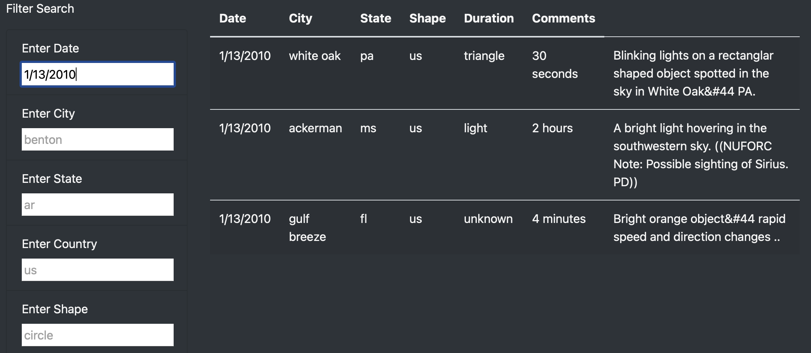
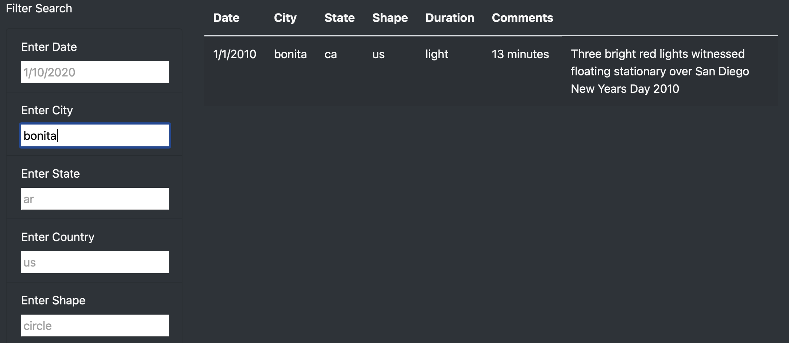
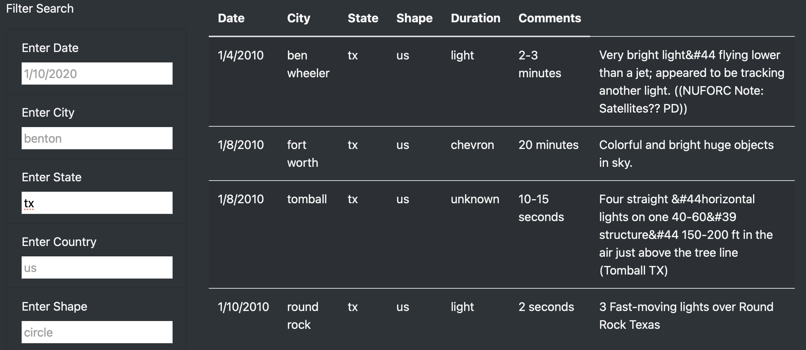
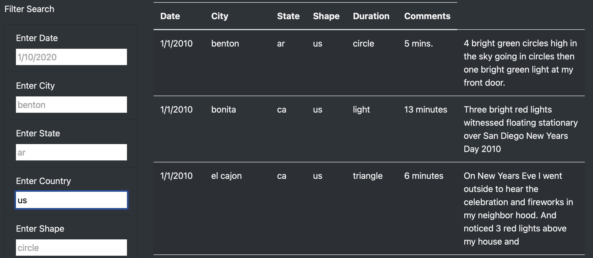
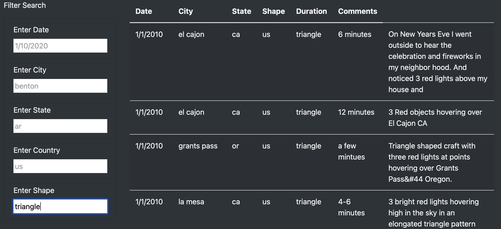
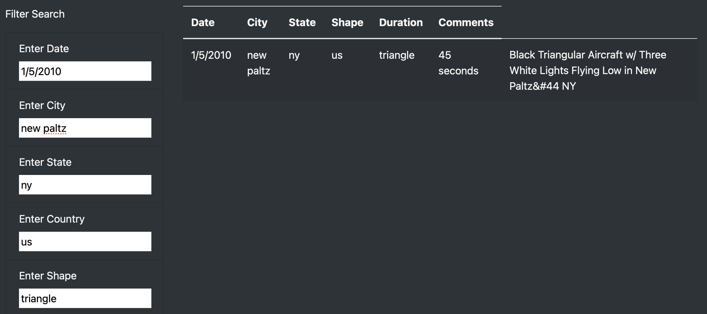

# UFOs

## Overview of Project

In this project Dana who is a data journalist has been given the opportunity to write about UFO sightings. She has to use JavaScript to display sightings data that stored in an array in a JavaScript file. As a result of this she wants to build a dynamic webpage that would include a  table filled with data to support her findings, her article and easy to use filters to fine tune the results.

### Purpose

The purpose of this projet is to help Dana provide more detailed analysis of UFO sightings by giving the users the option of filtering multiple criterias in terms of city, state, country and shape in addition to date criteria that was added initially. Hence, JavaScript and HTML has to be used for modifying the **index.html** file to create the additional table filters.

## Results

This section of the project focuses on the the process of using the new webpage by using the search criterias to filter the data in table.

### Page Initializing

The user can reset the webpage after a filter has been applied to the table by simply clicking the **UFO Sightings** link displayed in the navbar as shown in the figure below. This has been achieved by linking to the homepage, **index.html** to reload the page and display the default unfiltered table which would be ready for a new input. 

### Date Filter Criteria

The user can filter the table to only display the data based on a certain date and this can be done by simply entering a date same as the diplayed placeholder in the **Enter Date** field of the filter search as illustrated in the figure shown below. If the date exists in the data, the table will get updated and the data will get returned based on the entered date, however if the entered date is not present within the data, an empty table will get returned.

### City Filter Criteria 

The table can get updated based a desired city entered by the user into the **Enter City** field as shown in the figure depicted below.

### State Filter Criteria

The data can get filtered to update the table based on the a specific state simply by inputting the desired state as shown in the figure below. Additionally, the user has to ensure that the state is entered same as the sample displayed by simply entering the state shortcut such as "ar" instead of "Arkansas" otherwise the data won't get returned.

### Country Filter Criteria

The table can get updated based on the country by simply inputting the desired country into the **Enter Country** field of the search criteria.

### Shape Filter Criteria

Lastly, the desired shape can be entered by the user simply by following the placeholder displayed to update the data accordingly.

### Combination of Filters

The table can further be filtered by simply inputting multiple filtering parameters at the same time as illustrated in the figure below. This helps the user to view data based on multiple criterias of their choice at the same time.

## Summary

In conclusion, the webpage and dynamic table are working as intended and successfully providing more in-depth analysis of UFO sightings by implementing multiple filtering criterias for the user to input. 

- The new design of the webpage has a drawback that has to be taken into consideration. By adding the filtering options we intended to help the user save time and view data based on desired criteria they input, however, the user has to still go through the table and see which years, cities, countries are present in the dataset. For instance, the table has only dates for year 2011 and the user might be inputting years other than 2010 and everytime a an empty table in return which would be frustrating. 

- As a result it is a good idea to take certain recommendations into account for further development of the webpage. It is highly recommended to further alter the filter search fields by creating a dropdown menu that appears when the user clicks on the search fields of each of the criteria. As this helps the user select their desired filtering criteria from the options provided and preventing them from entering an option that doesnt exist in the dataset.

- Adding a reset filter button under the last filter field would be very helpful and more functional as it would enable the users to easily reset their filters to view the default data again rather than having to scroll up everytime and clicking the UFO Sightings link to reload the page.